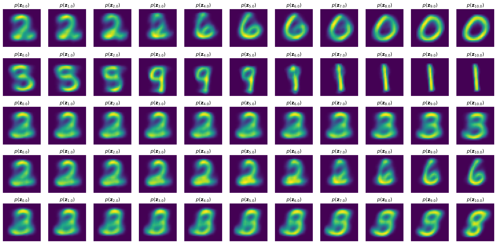
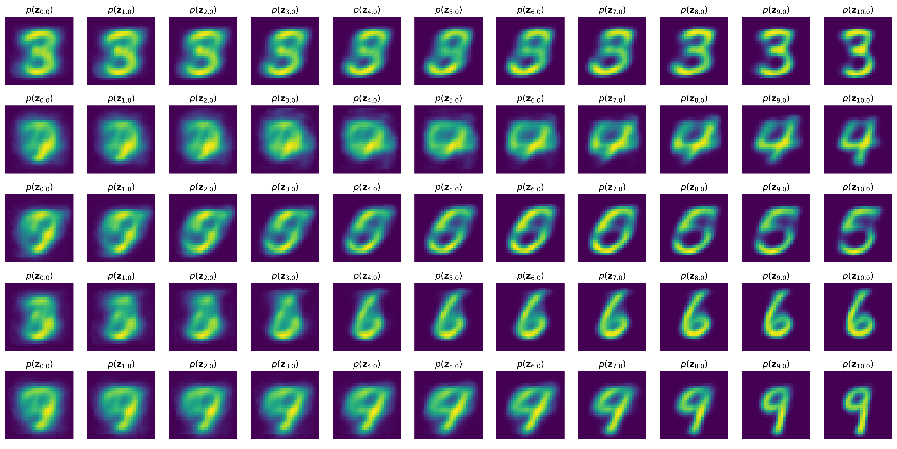
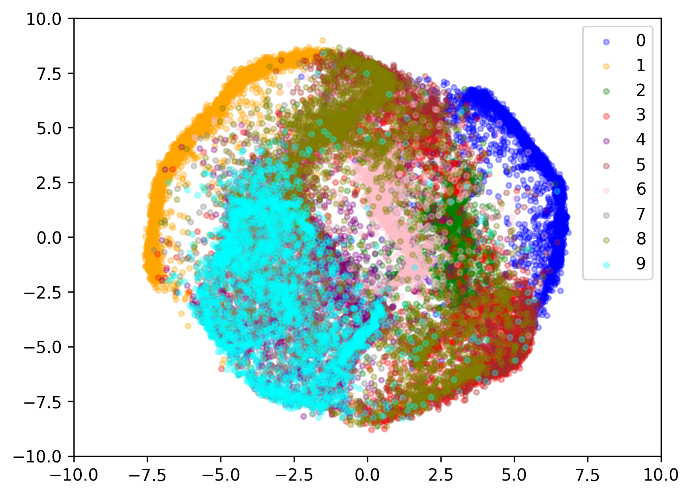
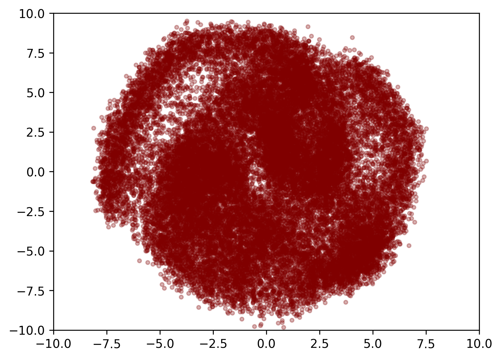

# Latent CNF (Continuous Normalizing Flows)

An implementation of the mnist image generator using CNF.  
(CNF is generative model which is introduced in [NeuralODE](https://arxiv.org/abs/1806.07366).)

Get a latent of image using an image encoder and train CNF to generate latent.  
During inference, generated latent is decoded by image decoder.

## Generation Result

- $t_0 = 0,\ t_1 = 10$
- $\mathbf{z}_{t_0} \sim \mathcal{N}(0, I)$
- $\mathbf{z}_{t_1}: target\ distribution$

(In the code, the covariance matrix of $\mathbf{z}_{t_0}$ is not $I$, but a diagonal matrix with a diagonal element of $0.1$. For convenience, Denoted as $I$.)

Visualize the sample of $\mathbf{z}_{t_0}$ flowing to $t_1$ through the CNF. (Decoded into image)

<table align="center">
<tr align="center">
<td><b>Without Encoder Condition<br>
Without Discriminator<br>
Latent Dimension = 2</b>
<td><b>With Encoder Condition<br>
With Discriminator<br>
Latent Dimension = 8</b>
</tr>
<tr align="center">
<td>
<td>
</tr>
</table>

## Latent Visualization

Latent dimension is set to 2.

<table align="center">
<tr align="center">
<td><b>Latent Generated by ImageEncoder</b>
<td><b>Latent Generated by CNF</b>
</tr>
<tr align="center">
<td>
<td>
</tr>
</table>

## Usage

### Train

```bash
python3 train.py
```
